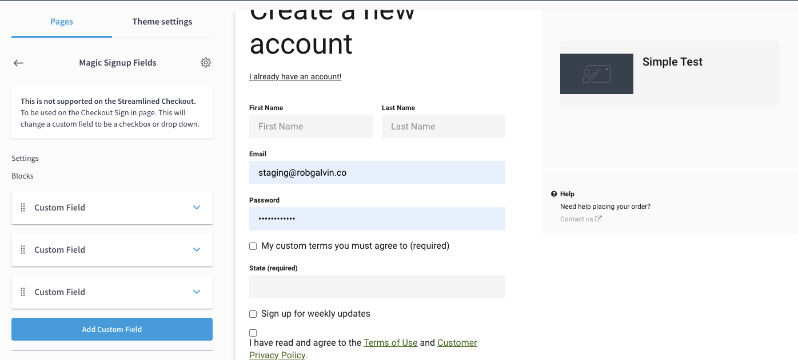
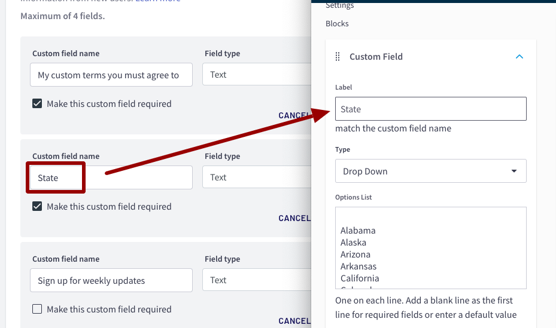

# Magic Sign Up Fields


_**Warning** - this super power is defenseless against the "Streamlined Checkout"_ 🦹. In order to use the Magic Sign Up Fields, you will have to disable the Streamlined Checkout option




### How to use this super power:

* [ ] Add your custom fields into your Site Settings
* [ ] On the **Checkout Sign Up** page, add the **Magic Signup Fields** section
* [ ] Inside the Magic Signup Fields settings, add a block for each custom sign up field that you would like to turn into a drop-down or a checkbox
* [ ] Make sure the Label matches the _Custom field name_ you used





### Dropdown Field Types

To change a custom sign up field to be a drop down:

* [ ] Inside of the Magic Sign Up Fields block settings, change the **Type** setting to Drop Down
* [ ] Then add your list of options \([for example a list of states](https://textlists.info/geography/list-of-u-s-states/)\)


The first item on the list will be default. If you would like to force your user to select one, then add a blank line as the first item and also set the field to be required in your Site Settings page


### Checkbox Field Types

To change a custom sign up field to be a checkbox, you have two choices

**Type 1: Allow the checkbox to be on or off**

* [ ] Make sure the Label matches the Custom field name you used
* [ ] Inside of the Magic Sign Up Fields block settings, change the Type setting to **Checkbox**

**Type 2: Only allow the user to sign up if they checked the box**

* [ ] Make sure the Label matches the Custom field name you used
* [ ] Inside of the Magic Sign Up Fields block settings, change the Type setting to **Checkbox \(Must Acknowledge - Required\)**
* [ ] **Be sure the custom sign up field is also set to be required on the Site settings page.** 

### Understand the difference between "Sign Up" page and the "Checkout Sign in" page

The Magic Sign up fields can be used on both pages, but does require you to place the section on both pages separately.




The magic signup fields does not change the account profile page and add drop downs \(due to not being able to control this page from Site Builder. It is recommended that the custom sign up fields be hidden from the account profile page, by adding this snippet of code to your Site Footer Code section


#### Hiding the custom sign up fields on the account profile page:

```css
<style> .my-account__form-contents .form__group:nth-child(n+6){ display:none; } </style>
```

